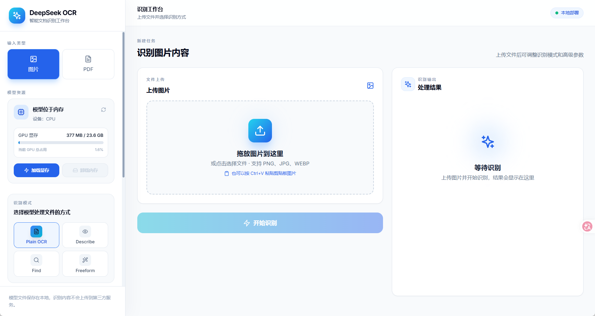

# DeepSeek OCR 识别工作台

基于 **DeepSeek-OCR、FastAPI、React 和 Docker Compose** 构建的本地 OCR Web 应用，支持图片识别、PDF 多页处理、模型显存管理和多格式结果导出。



## 功能

- 图片 OCR：支持 PNG、JPG、JPEG、WEBP、GIF 和 BMP。
- PDF 处理：逐页识别并显示真实处理进度。
- 多种识别模式：普通 OCR、图片描述、内容查找和自定义提示词。
- 多格式导出：Markdown、HTML、Word 和 JSON。
- 模型资源管理：模型默认保存在 CPU 内存中，可手动加载到 GPU 或卸载回内存。
- GPU 状态：显示已用显存、总显存和使用率。
- 本地模型缓存：模型文件保存在项目的 `models/` 目录，重新构建容器时不会重复下载。
- 响应式界面：支持桌面端和手机端，手机端可直接拍照或从相册选择图片。

## 默认端口与 GPU

| 项目 | 默认值 |
| --- | --- |
| 前端 | `30330` |
| 后端 API | `30380` |
| API 文档 | `30380/docs` |
| 使用的物理 GPU | 第 3 号卡 |
| 模型缓存目录 | `./models` |

应用默认监听 `0.0.0.0`，启动后可通过以下地址访问：

```text
http://服务器IP:30330
```

## 部署

### 1. 克隆项目

```bash
git clone https://github.com/Aaron-0303/deepseek_ocr_app.git
cd deepseek_ocr_app
```

### 2. 创建配置文件

```bash
cp .env.example .env
```

如需从其他电脑访问，请把 `.env` 中的 `CORS_ORIGINS` 改成实际前端地址，例如：

```env
CORS_ORIGINS=http://10.157.197.46:30330
```

### 3. 启动服务

```bash
docker compose up -d --build
```

查看运行状态：

```bash
docker compose ps
docker compose logs -f
```

首次启动时，如果 `models/` 中没有模型文件，后端会自动下载模型。之后模型会保留在本地目录中，更新或重新构建容器不会重复下载。

## 使用方法

1. 打开 `http://服务器IP:30330`。
2. 在侧边栏点击“加载显存”，等待模型进入 GPU。
3. 选择图片或 PDF。
4. 选择识别模式并按需调整高级参数。
5. 开始识别并复制或下载结果。
6. 暂时不使用时，点击“卸载内存”，释放 GPU 显存。

## 更新项目

拉取最新代码：

```bash
git pull origin main
```

如果前后端均有修改：

```bash
docker compose up -d --build backend frontend
```

如果只修改前端：

```bash
docker compose up -d --build frontend
```

Docker 会复用没有变化的构建层，不会在每次构建时重新下载所有依赖，也不会不断创建一批正在运行的容器。Compose 会使用新容器替换对应的旧容器。

## 配置说明

主要配置位于 `.env`：

```env
API_HOST=0.0.0.0
API_PORT=30380
FRONTEND_PORT=30330

MODEL_NAME=deepseek-ai/DeepSeek-OCR
HF_HOME=/models
HF_ENDPOINT=https://hf-mirror.com
HF_HUB_DOWNLOAD_TIMEOUT=600
HF_HUB_ETAG_TIMEOUT=60

CORS_ORIGINS=http://localhost:30330
MAX_UPLOAD_SIZE_MB=100

BASE_SIZE=1024
IMAGE_SIZE=640
CROP_MODE=true
```

GPU 由 `docker-compose.yml` 中的以下配置指定：

```yaml
device_ids: ["3"]
```

如果要换卡，请修改这里的编号并重新创建后端容器。

## 常用命令

```bash
# 后台启动
docker compose up -d

# 停止服务
docker compose down

# 查看后端日志
docker compose logs -f backend

# 查看前端日志
docker compose logs -f frontend

# 只重建后端
docker compose up -d --build backend

# 只重建前端
docker compose up -d --build frontend
```

## 项目结构

```text
deepseek_ocr_app/
├── backend/              # FastAPI、模型推理和文档转换
├── frontend/             # React 前端与 Nginx 配置
├── assets/               # README 界面预览图
├── models/               # 本地模型缓存，不随容器删除
├── docker-compose.yml
└── .env.example
```

## 技术栈

- 前端：React 18、Vite、Tailwind CSS、Framer Motion、Axios
- 后端：FastAPI、PyTorch、Transformers、PyMuPDF
- 部署：Docker Compose、Nginx、NVIDIA Container Toolkit

## 注意事项

- 服务器需要安装 NVIDIA 驱动、Docker、Docker Compose 和 NVIDIA Container Toolkit。
- 请确保防火墙允许访问前端端口 `30330`。
- 模型加载到 GPU 前无法执行识别。
- 不要删除 `models/` 目录，否则模型需要重新下载。

## 许可证

项目许可证见 [LICENSE](LICENSE)。使用 DeepSeek-OCR 模型时还需遵守其对应的模型许可证。
